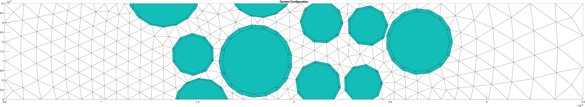
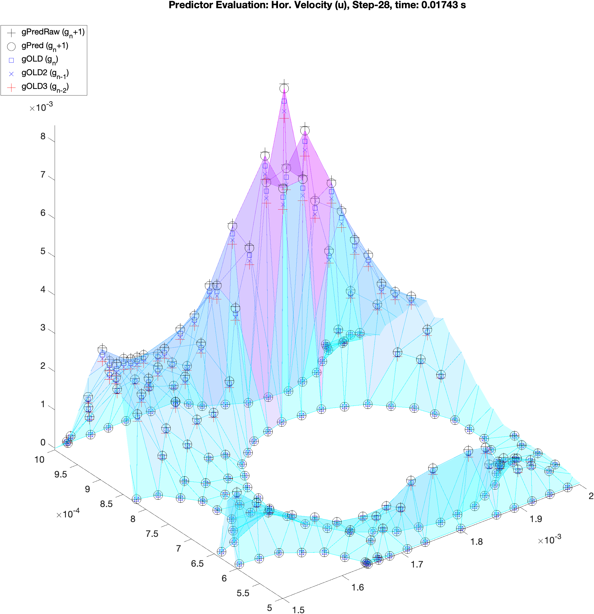

# Jeevan's Notebook
<!-- MarkdownTOC autolink="true" levels="1"-->

- [Bacteria sim \(MDPI\)](#bacteria-sim-mdpi)
- [Predictor-Corrector](#predictor-corrector)
- [FEM time stepping](#fem-time-stepping)
- [Egg spinning](#egg-spinning)
- [MISC](#misc)

<!-- /MarkdownTOC -->


# Bacteria sim (MDPI)
Relevant links:

- [Instruction for authors](http://www.mdpi.com/journal/powders/instructions)
- [Submission portal](http://susy.mdpi.com) (choose the journal 'Powders')

## General outline
- Intro: problem, purpose, limitations
	- Problem: micromechanical understanding of bacterial transport in porous medium
	- Purpose: Demonstrate our physically accurate FEM-DEM method -> extending the FEM-DEM application into bio-mechanical applications
	- Limitations: highly simplified test case: non-motile bacteria
- FEM-DEM Method, how it works?
- High fidelity simulation: the high accuracy details we can get from the method
- Extending the FEM-DEM application into bio-mechanical applications
	-  The things we can add *while maintaining the accuracy* to our FEM-DEM, to extend it's application into the bio-mechanical cases. 


# Predictor-Corrector

*Project directory*: `/Users/jvn/MATLAB/0_bacteriaFlow`

### Notes:
Predictor for fluid velocity:

- Using 'variable step-size leapfrog' from Gresho-Sani (see pg. 805-806)
- Weird stuffs???
	- Code is different with the formula in the book?
	- Number of iterations is changing too much? is the predicted values wrong? Convergence only due to Newton-Raphson's iterations?
	
HG: Hilbert interpolation? HG is making the program as matlab does not have the hilbert function

To do:

- Do time sequence plot. Investigate the change in values of the not-predicted and predicted. Which values does the NR uses for the initial value? Is it v(t) or v(d+t)?
- From 3 time steps and show the predicted value (u,v,p), before and after newton-raphson
	- mark the final value
- **use porous flow with increasing velocity inflow for a test case**
	- low Re, complex flow profile
	- we need some source of instability, otherwise it will be only a stationary flow


### Predictor Corrector Logic:
'generalized leapfrog' for predictor, as recommended by Gresho-Sani:

$$
y^P_{n+1} = y_n + \left(1+\frac{\Delta t_n}{\Delta t_{n-1}}\right)\Delta t_n \dot{y}\_n - \left(\frac{\Delta t_n}{\Delta t_{n-1}}\right)^2(y_n-y_{n-1})
$$

`bdf2a_error.m`:
```
%  Predict the velocity via 'generalized leapfrog':
%  General Step, Step 1, Gresho-2000, p. 805. Eq.3.16-248
gPred(uIndx) = gOLD(uIndx) + ( 1+dtRatio )*dt*gDotOLD(uIndx) ...
           - ( dtRatio^2 )*( gOLD(uIndx)-gOLD2(uIndx) );
gPred(vIndx) = gOLD(vIndx) + (1 + dtRatio)*dt*gDotOLD(vIndx) ...
           - ( dtRatio^2 )*( gOLD(vIndx)-gOLD2(vIndx) );
gPred(pIndx) = gOLD(pIndx);
gPred_output = gPred;
```

`gPred` is now used as input for:
```
[a,ascaled,g,iter,hasError,res] = newtonbdf2a(area,eqn,gPred,gOLD,...
  gOLD2,dt,dtRatio,indx,nelem,neqn,node,np,phi,region,nParticle,PX,PY,VF,VX,...
  VY,xc,yc,owner,it);
```


`bdf2a_error.m` is located in the main driver, under the corrector-step comment (why???):
```
%% First corrector-step
    % Non-stationary solution via BDF2
    [g,iter,dtNew,hasError,Cnum,CnumScale,~,res] = bdf2a_error(gOLD,gOLD2,gOLD3,nelem,neqn,indx,npWOMid,dt,dtOld,...
        it,node,np,area,eqn,phi,region,particleNum,PX,PY,VF,VX,VY,xc,yc,owner);

    % Getting the solutions (velocities and pressures) out of G as U, V, P
    [u,v,p] = evaluateG(np,node,nelem,indx,g);
```


- initial `g` is the stationary solution, immediately broken down to `u`,`v`,`p` and copied as `uOLD`, `vOLD`, and `pOLD`
- `uOLD`, `vOLD`, and `pOLD` interpolated into `gOLD`. That's the end of the *Predictor* step.
- Which makes:
	- `g` is \\(g_{n+1}\\)
	-  `gOLD` is \\(g_{n}\\)
	-  `gOLD2` is \\(g_{n-1}\\)
	-  `gOLD3` is \\(g_{n-2}\\)
- In the *Corrector*, `gOLD`,`gOLD2`,`gOLD3` is the input for `bdf2a_error.m`

#### Monitoring the predictor:

- Store `gOLD`,`gOLD2`,`gOLD3` for every time step. `g` is not needed as it should be the same as `gOLD` (check pls!)
	- We should get a 'stack' of three layers every time step, converging to the predicted `g` (or `gPred`?)
- `interpolationPrepare.m` interpolates every `gOLD`s into the current, step-n, mesh. So, `gOLD`s are all on the same mesh	

Location of the monitor: main driver, right after `bdf2a_error`. `gPred` is already fixed by the Newton-Raphson within `bdf2a_error` -> new var added `gPredRaw`
```
if monitorPredictor
    % disassemble g to it's component
    [uOLD_monitor,vOLD_monitor,pOLD_monitor] = evaluateG(np,node,nelem,indx,gOLD);
    [uOLD2_monitor,vOLD2_monitor,pOLD2_monitor] = evaluateG(np,node,nelem,indx,gOLD2);
    [uOLD3_monitor,vOLD3_monitor,pOLD3_monitor] = evaluateG(np,node,nelem,indx,gOLD3);
    
    % plot
    figure(79); clf; hold on; % pressure
    hOLD = trisurf(delTriOutside.ConnectivityList,xc,yc,pOLD_monitor,pOLD_monitor);
    plot3(xc,yc,pOLD2_monitor,'ob');
    plot3(xc,yc,pOLD3_monitor,'xr');
%             hOLD2 = trisurf(delTriOutside.ConnectivityList,xc,yc,pOLD2_monitor,pOLD2_monitor);
%             hOLD3 = trisurf(delTriOutside.ConnectivityList,xc,yc,pOLD3_monitor,pOLD3_monitor);
    
    hOLD.FaceAlpha = 0.4;
    pbaspect([6 1 0.5]); axis tight; view(3);
    legend('gOLD (g_n)','gOLD2 (g_{n-1})','gOLD3 (g_{n-2})','location','southoutside','orientation','horizontal')
    set(gca,'fontsize',16)
end
```


[Predictor value vid](vids/PredictorEval-zoomLargedt2.mp4)

### BC setup
```
if t < 0.001
    inflowPeakVelo = 0.001; % 2x the width of the channel
else
    inflowPeakVelo = 0.001+(t-0.001)*(1/111); % should end with 10x initial peak velocity at t = 1 s
end
```


# FEM time stepping
## FEM element-size dependent time step size limit for fluid
*discussion with Jan, 06/07/2025*

Idea: particle should not move faster than one element size in a single time step.

We can do rough estimation of the particle velocity and estimate the time step limit. For example, limiting at max half an element per timestep.

$$
\Delta t_{max,fluid} = 0.5 \frac{l_{mesh}}{u_{particle}}
$$

HG:

- Adaptive time step size based on mesh size/quality might not be necessary, the new relaxation might be able to do large displacement of FEM nodes.

### To do:
- harass Shintani and Yamashita for the new relaxation
	- How large can the displacement of nodes be?
	- How does it react with fast moving particles (more than 1 element size per timestep?)?
	


# Egg spinning
## Camera for egg-spinning experiment
Issue: light reflection on the egg

Use [polarizing filters](https://en.wikipedia.org/wiki/Polarizing_filter_(photography)).

Buy standard CPL filters? check dimension:

- Measured diameter using caliper: 48 mm (inside dimension, including the threading, maybe it is 49 mm?)
- Info online: the lens are not the typical consumer camera lens
	- C-mount
	- Different front filter thread spec notation (e.g. M55 (P=0.75) -> diameter is 55 and 0.75 pitch for the threading)

### To do:
- Faheema recheck dimension, do we have specification sheet of the lens? Check the diameter and the threading. Is the standard thread pitch also 0.75?
- Maybe discuss with Jan?


# MISC
Clothing size:
Waki: L (Uniqlo)
Yamashita: 


